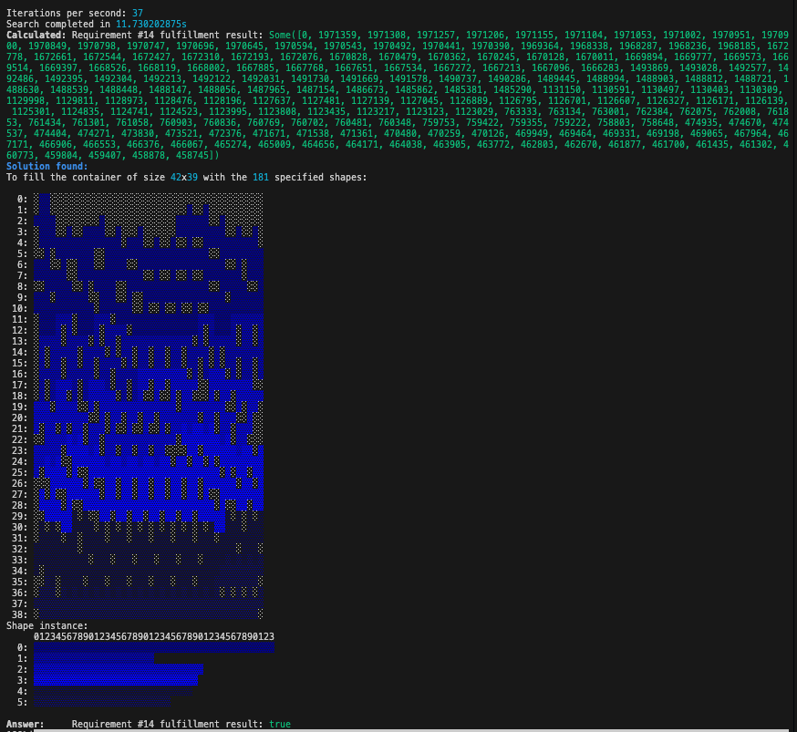

## Day 12: Christmas Tree Farm



This is another one of those problems that makes Z3 and OR-Tools very appealing, but we also learn nothing by just using them as black boxes. So let's try to solve it with a more hands-on approach.

We will use [Algorithm X](https://en.wikipedia.org/wiki/Knuth's_Algorithm_X) with [SIMD BitVec](https://docs.rs/bitvec_simd/latest/bitvec_simd/struct.BitVecSimd.html#method.from_slice).

Here's a screenshot of the search in progress:

```text
Current path: [0, 353, 970, 1039]
Available shapes: ShapeCounts([0, 0, 0, 0, 4, 0])
Required shapes : ShapeCounts([0, 0, 0, 0, 2, 0])
  0: ███░░███░█░█
  1: ░██░░░█░░███
  2: ░███████░█░█
  3: ░░░███░░░░░░
  4: ░░░░██░░░░░░
Shape instance:
     01
  0: █
  1: 
  2: █
  3: 
  4: ░░
  5: ██
```

Each of the `░` or `█` a state. The upper part is the grid, where each cell in the grid is a state, and the lower part is the number of instances per shape required by the input. Our objective is to ensure the latter is filled, while the former does not have any overlapping states.

For this purpose, we map out all the possibilities of
- rotating and flipping each shape
- placing each shape at each possible position on the grid
- the chosen shape taking up one of the required shape instances

This gives us a huge list of "Placement"s, each of which covers a set of states on the grid, and uses up one instance of a shape. Since the condition to merge them no longer depends on the actual grid layout, we can represent each placement as a bit vector, where each bit represents whether a state is covered or not.

With this representation, we can use Algorithm X to search for a combination of placements that covers all the required shapes without overlapping on any grid states. By using SIMD BitVecs, we can efficiently perform the necessary bitwise operations to check for overlaps and coverage during the search process.

## Heuristics

To speed up the search, we can apply some heuristics:

- **Early Pruning**: If at any point the number of remaining placements for a shape is **less than the number required of that shape**, we can prune that branch of the search.
- **Most Constrained First**: Always try to place the shape that has the **fewest remaining placements** first. This reduces the branching factor early in the search.
- **Compaction**: (unimplemented) Since a shape does not occupy the whole 3x3 max shape, there would be "holes" in the space it could have filled. Instead of just parking the next shape along the next 3x3 block, we can sort the placements by the ones that can fill in the maximum number of holes from the previous step first.

## Impossibility and input rigging

The algorithm is not fast, but it is well enough to provide a solution if one exists.

However if no solution exists, it will take a very long time to exhaust all possibilities. In such cases, we can try to prove impossibility by other means.

The obvious first thing to do is to sum up all the required shapes' areas, and see if it exceeds the grid area. If it does, we can immediately conclude that it's impossible... which funny enough, solves the provided input??!

It probably is the case that no solution being such a hard problem to solve, that Eric's own algorithm could not have crunched it for the unique inputs for each user.

## Unit tests

The test cases provided in the example are included in the unit tests, and it is able to find the solution of Test #2 in about 1s:

```text
Iterations per second: 1278808
Search completed in 1.047824542s
Solution found:
To fill the container of size 12x5 with the 6 specified shapes:

  0: ░░▒▒▒░░░▒░▒░
  1: ░░▒░▒░░░▒▒▒░
  2: ▓░▒▒▒▒▓▓▒▒▒▒
  3: ▓▓▓▒▒▒▓▓▓▒░▒
  4: ▓▓▓▒░▒░▓▓▒▒▒
Shape instance:
     01
  0: ▓
  1: 
  2: ▓
  3: 
  4: ▒▒
  5: ▒▒
```

Room for improvement remains, especially in the heuristics department.